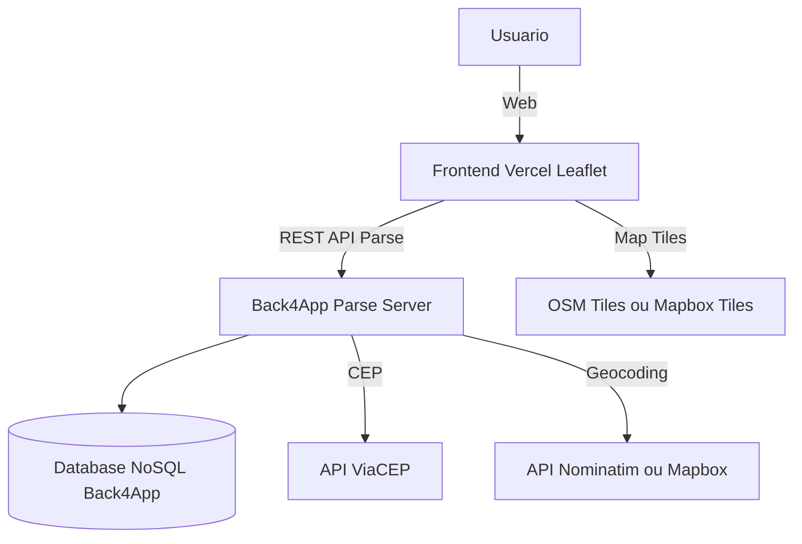

# Desenrola Aí – Uma plataforma que conecta profissionais e clientes

Projeto de sistema multiplataforma que conecta prestadores de pequenos serviços (jardinagem, aulas, consertos etc.) a clientes, com foco em impacto social local.

## Problema abordado e justificativa
Com base em observações diretas e conversas com trabalhadores informais e prestadores de serviços na região de Fortaleza, verificou-se que uma parcela significativa da população recorre ao trabalho informal e enfrenta desafios para a divulgação do seu trabalho. Muitos moradores possuem habilidades em pequenos serviços (jardinagem, consertos, aulas particulares etc.), mas, apesar de utilizarem redes sociais como o Instagram para divulgação, não contam com um sistema que ofereça maior segurança e avaliação por parte de outros usuários. Isso se traduz em incertezas tanto para os prestadores de serviços — que buscam um canal confiável para ofertar seus serviços — quanto para os potenciais clientes, que necessitam de uma plataforma ágil e segura para encontrar, avaliar e contratar prestadores confiáveis.

Diante disso, pensou-se em construir uma plataforma que conecte prestadores de pequenos serviços e clientes, facilitando a busca, solicitação e contratação de serviços locais.

### Relacao com os ODS
- **ODS 11 – Cidades e Comunidades Sustentaveis (enfase principal)**: fortalece economias de bairro, reduz deslocamentos desnecessarios e facilita acesso a servicos urbanos.
- **ODS 8 – Trabalho Decente e Crescimento Economico**: incentiva geracao de renda e inclusao produtiva.
- **ODS 10 – Reducao das Desigualdades**: amplia acesso a oportunidades e informacoes.

## Objetivos do sistema
- Cadastro/autenticacao de usuarios (clientes e prestadores)
- Cadastro/edicao/exclusao de servicos
- Busca com filtros por categoria
- Solicitacao de contratacao com registro de status
- Integracao Frontend (Vercel) e Backend (Back4App Parse)
- Testes de API documentados em Postman
- Prototipos multiplataforma (web + mobile via Figma)

## Escopo do MVP
**Incluido**: cadastro, login, CRUD de servicos, busca/filtros, solicitacoes e controle de acesso, integracao Frontend/Backend.  
**Fora do escopo (backlog)**: pagamentos online, avaliacoes/comentarios, notificacoes push, geolocalizacao.

## Visao geral da arquitetura

## Tecnologias propostas
- **Frontend**: HTML5, CSS, JavaScript, Bootstrap
- **Hospedagem Frontend**: Vercel
- **Backend**: Back4App (Parse Server) com Cloud Code em JavaScript
- **Banco de Dados**: NoSQL (classes e queries do Parse)
- **API**: REST API Parse Server
- **Testes de API**: Postman
- **Ambiente de Desenvolvimento**: VS Code
- **Controle de Versao**: GitHub
- **Prototipacao Mobile**: Figma
- **APIs externas**: ViaCEP (CEP→endereço) + Nominatim/Mapbox/Google (endereço→lat/lng)
- **Mapas**: Leaflet + OSM/Mapbox Tiles

## Cronograma para Etapa 2 (N708)
| Fase | Atividades principais | Data prevista |
|------|------------------------|---------------|
| 1. Iniciacao | Revisao do planejamento e alinhamento com orientador | 02-09-2025 |
| 2. Planejamento detalhado | Refinamento de requisitos e modelagem final (Parse classes, Cloud Code) | 05-09-2025 |
| 3. Configuração do Ambiente de desenvolvimento | Ambiente de desenvolvimento pronto (ferramentas, repositório, etc) | 08-09-2025 |
| 4. Implementação – Parte 1 | Implementação dos requisitos RF11 a RF14 (Front-end e Back-end) | 19-09-2025 |
| 5. Entrega parcial | Entrega da atividade completa da disciplina N705 e N703 (Testes de integração das APIs, Documentação e implementação dos requisitos RF11 a RF14| 27-09-2025 |
| 6. Implementação – Parte 2 | Implementação dos requisitos RF01 a RF10 | 17-10-2025 | 
| 7. Testes | Testes com Postman e validacao de fluxos | 24-10-2025 |
| 8. Encerramento | Ajustes finais e entrega oficial | 07-11-2025 |

## Integrantes da equipe e papeis
- **Francisco Riomar Barros Filho** – Product Owner, UX/UI, Responsável pela documentação
- **Francisco Augusto de Oliveira Filho** – Dev Frontend
- **Lucas Pires Albuquerque** – Dev Frontend
- **Cezarnildo Moreira da Silva** – Dev Backend
- **Jose Claudecir Silva de Lima** – Dev Backend
- **Francisco Rodrigues de Oliveira Lima** – analista de testes e qualidade
  

> Documento alinhado a disciplina **N705 – Projeto Aplicado Multiplataforma Etapa 1** e integrado com a **N703 – Tecnicas de Integracao de Sistemas**, adaptado a partir da experiencia com **N697 – Desenvolvimento de Software em Nuvem**.
