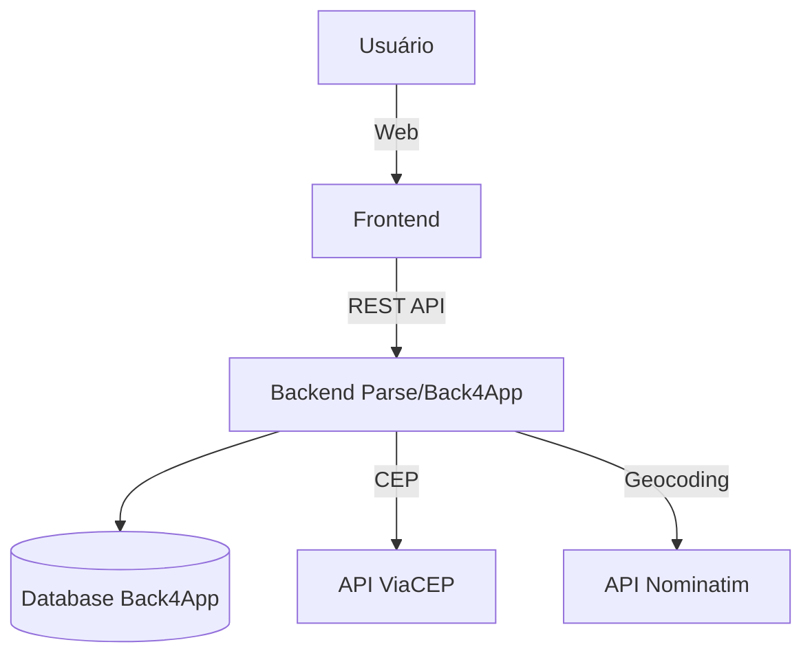

# Desenrola Aí — Plataforma que conecta profissionais e clientes

Projeto de sistema multiplataforma que conecta prestadores de pequenos serviços (jardinagem, aulas, consertos etc.) a clientes, com foco em impacto social local.

## Problema abordado e justificativa
Em Fortaleza, muitos trabalhadores informais têm dificuldade de divulgar seus serviços e não contam com avaliações/confiabilidade. A plataforma facilita busca, solicitação e contratação de serviços locais com mais segurança.

### Relação com os ODS
- **ODS 11 – Cidades e Comunidades Sustentáveis** (ênfase): economias de bairro, menos deslocamentos.
- **ODS 8 – Trabalho Decente e Crescimento Econômico**: geração de renda e inclusão produtiva.
- **ODS 10 – Redução das Desigualdades**: amplia acesso a oportunidades.

## Objetivos do sistema
- Cadastro/autenticação de usuários (clientes e prestadores)
- Cadastro/edição/exclusão de serviços
- Busca com filtros por categoria
- Solicitação de contratação com registro de status
- Integração Frontend (web) e Backend (Parse/Back4App)
- Testes e documentação de API

## Escopo do MVP
Incluído: auth, CRUD de serviços, busca/filtros, solicitações e controle de acesso, integrações ViaCEP/geo.  
Backlog: pagamentos, avaliações/comentários, notificações push, geolocalização avançada.

## Visão geral da arquitetura


## Tecnologias
- Frontend: HTML, CSS, JavaScript, Bootstrap
- Backend: Node.js + Express + Parse SDK (Back4App)
- Banco: Classes Parse (NoSQL) no Back4App
- APIs externas: ViaCEP (CEP→endereço), Nominatim (geocoding)
- Testes: Jest/Supertest (backend)

## Estrutura do repositório
- `backend/`: API Node.js + Express + Parse (Back4App)
- `frontend/web/`: frontend web consumindo a API
- `database/`: referência de schema
- `docs/`: requisitos, arquitetura, modelo de dados e documentação de API
- `prototypes/`: protótipos Figma (web e mobile)
- `validation/`: público-alvo, relatório e evidências de validação

## Como rodar (dev) — passo a passo para iniciantes
**Pré-requisitos:** Node 18+ e uma conta/app no Back4App. Nunca versione a `PARSE_MASTER_KEY`.

1) Clonar e instalar  
- `git clone <repo>` e entre na pasta.  
- Backend: `cd backend && npm install`  
- Frontend: `cd ../frontend/web && npm install`

2) Criar app no Back4App  
- Acesse https://www.back4app.com e crie conta.  
- Crie um novo app Parse; em “Security & Keys” anote: Application ID, JavaScript Key, REST API Key, Server URL (`https://parseapi.back4app.com`).  
- Guarde a Master Key apenas localmente.

3) Criar classes (schema)  
Via Dashboard (clique em Create Class) ou via REST com Master Key:  
- `_User`: campos extras nome, telefone, role (CLIENTE/PRESTADOR), cep, logradouro, numero, bairro, cidade, uf.  
- `Servico`: titulo, descricao, categoria, preco (String), prestadorId, prestadorNome, cidade, uf, cep, logradouro, numero, bairro, complemento, latitude (Number), longitude (Number).  
- `Solicitacao`: servicoId, clienteId, prestadorId, status, servicoTitulo, servicoCategoria, servicoPreco (String), servicoPrestadorNome, clienteNome, prestadorNome, detalhes, endereço (cep/logradouro/numero/bairro/cidade/uf/complemento), latitude/longitude, geocode_precision.

4) Configurar `.env` do backend  
- Em `backend`, copie `.env.example` para `.env`.  
- Preencha `PARSE_APP_ID`, `PARSE_JS_KEY`, `PARSE_REST_KEY`, `PARSE_SERVER_URL` (do Back4App).  
- Porta padrão: `PORT=3001`. Não commitar a Master Key.

5) Subir o backend (API)  
- `cd backend && npm run dev`  
- Verifique “Backend listening on port 3001”.

6) Subir o frontend (web)  
- `cd frontend/web && npm run dev` (ou `npm start` se configurado)  
- Acesse `http://localhost:3000` (chama a API em `http://localhost:3001` por padrão).

7) Fluxo rápido para testar  
- Crie conta em `auth.html` (cliente ou prestador).  
- Prestador: cadastre um serviço em “Meus serviços”.  
- Cliente: em “Serviços disponíveis”, clique “Solicitar contratação” e preencha detalhes/endereço.  
- “Minhas solicitações”: cliente vê enviadas; prestador vê recebidas e pode aprovar/recusar/cancelar.

8) Perfil  
- Menu suspenso → “Meu perfil”.  
- Clique “Editar”, altere dados, “Salvar alterações”.

9) Dicas rápidas  
- Se a API não responde, confira backend na porta 3001 e chaves no `.env`.  
- Se o front não mostra dados, recarregue (Ctrl+Shift+R) e mantenha backend e frontend rodando.  
- Nunca exponha a `PARSE_MASTER_KEY` em commits públicos.

### (Opcional) Criar schema via REST (Postman/Insomnia)
Use apenas para montar as classes no Back4App; requer Master Key (não publique).  
- Base: `https://parseapi.back4app.com`  
- Headers:  
  `X-Parse-Application-Id: <APP_ID>`  
  `X-Parse-REST-API-Key: <REST_KEY>`  
  `X-Parse-Master-Key: <MASTER_KEY>`  
  `Content-Type: application/json`

POST `/schemas/Servico` (exemplo):
```json
{
  "className": "Servico",
  "fields": {
    "titulo": { "type": "String" },
    "descricao": { "type": "String" },
    "categoria": { "type": "String" },
    "preco": { "type": "String" },
    "prestadorId": { "type": "String" },
    "prestadorNome": { "type": "String" },
    "cidade": { "type": "String" },
    "uf": { "type": "String" },
    "cep": { "type": "String" },
    "logradouro": { "type": "String" },
    "numero": { "type": "String" },
    "bairro": { "type": "String" },
    "complemento": { "type": "String" },
    "latitude": { "type": "Number" },
    "longitude": { "type": "Number" }
  }
}
```

POST `/schemas/Solicitacao` (exemplo):
```json
{
  "className": "Solicitacao",
  "fields": {
    "servicoId": { "type": "String" },
    "clienteId": { "type": "String" },
    "prestadorId": { "type": "String" },
    "status": { "type": "String" },
    "servicoTitulo": { "type": "String" },
    "servicoCategoria": { "type": "String" },
    "servicoPreco": { "type": "String" },
    "servicoPrestadorNome": { "type": "String" },
    "clienteNome": { "type": "String" },
    "prestadorNome": { "type": "String" },
    "detalhes": { "type": "String" },
    "cep": { "type": "String" },
    "logradouro": { "type": "String" },
    "numero": { "type": "String" },
    "bairro": { "type": "String" },
    "cidade": { "type": "String" },
    "uf": { "type": "String" },
    "complemento": { "type": "String" },
    "latitude": { "type": "Number" },
    "longitude": { "type": "Number" },
    "geocode_precision": { "type": "String" }
  }
}
```

PUT `/schemas/_User` (exemplo):
```json
{
  "fields": {
    "nome": { "type": "String" },
    "telefone": { "type": "String" },
    "role": { "type": "String" },
    "cep": { "type": "String" },
    "logradouro": { "type": "String" },
    "numero": { "type": "String" },
    "bairro": { "type": "String" },
    "cidade": { "type": "String" },
    "uf": { "type": "String" }
  }
}
```

Depois de criar, ajuste permissões no Dashboard (Class Level Permissions) e use apenas APP/JS/REST keys no código; a Master Key fica fora do repositório.
