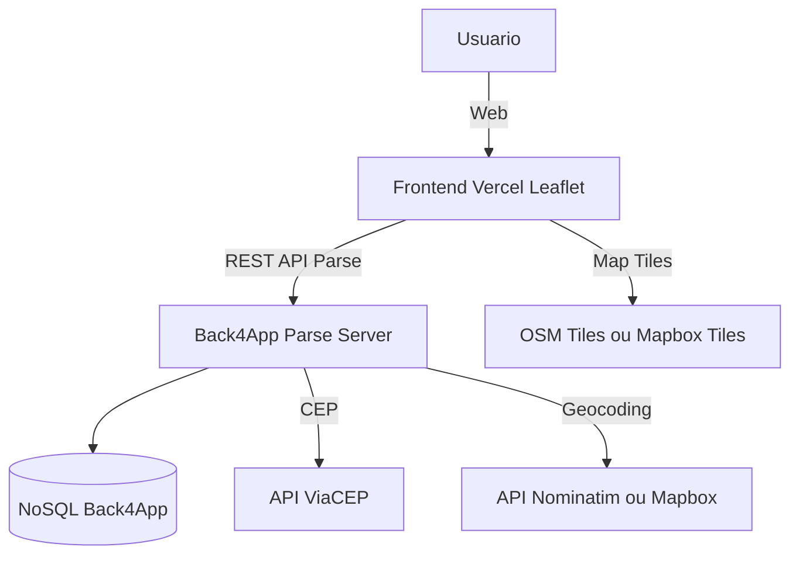
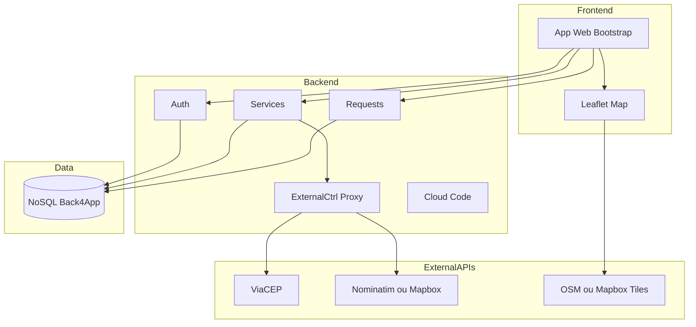
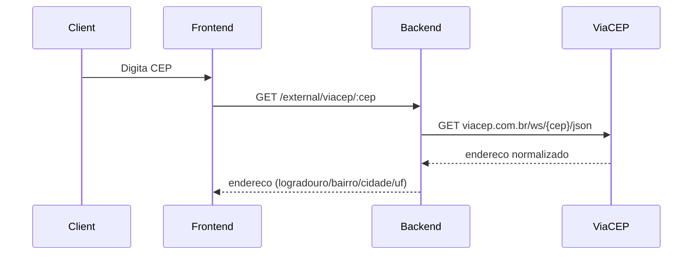
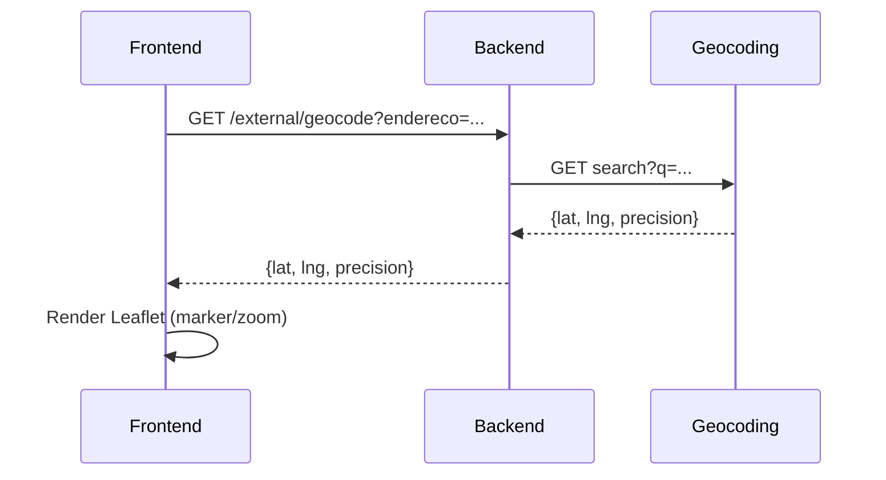
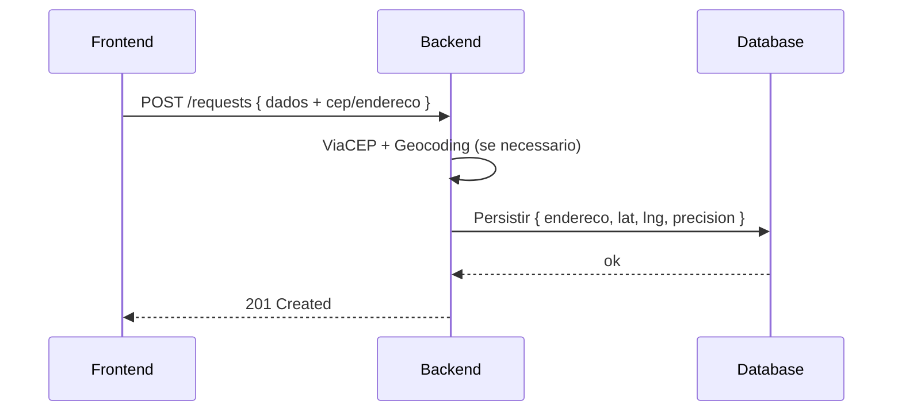

# Arquitetura – Desenrola Ai

> Documento alinhado ao **README.md** (stack Vercel + Back4App/Parse + Leaflet + APIs externas) e coerente com **requirements.md** (RF/RNF incluindo ViaCEP, geocoding, proxy, cache) e **database_model.md** (campos de endereco e coordenadas).

---

## 1. Objetivo
Descrever a arquitetura logica e de integracao do **Desenrola Ai**, cobrindo camadas, componentes, fluxos principais e atributos de qualidade. Este documento serve como guia para implementacao, testes e manutencao.

---

## 2. Visao Geral (Contexto)

**Notas de contexto**
- O **Frontend** (Vercel) usa **Leaflet** para mapa e consome **apenas** a API do backend.
- O **Backend** (Parse Server) concentra integracoes externas: **ViaCEP** (CEP→endereco) e **Geocoding** (endereco→lat/lng).
- **Tiles** do mapa (OSM/Mapbox) sao consumidos diretamente no frontend para renderizacao do Leaflet.

---

## 3. Componentes e Responsabilidades

### 3.1 Frontend (Vercel)
- **UI Web** (HTML, CSS, JS, Bootstrap) e **Leaflet** para mapa.
- Formularios de cadastro/login, listagem e detalhamento de servicos e solicitacoes.
- Chama **somente** a API do backend (evita depender de CORS externos).

### 3.2 Backend (Back4App Parse Server)
- **Resources** para usuarios, servicos e solicitacoes (CRUD).
- **Cloud Code** (JS) para regras de negocio, validacao e orquestracao.
- **ExternalCtrl (proxy)**: funcoes/rotas para **ViaCEP** e **Geocoding** (timeout, tratamento de erro, cache).
- **Autenticacao** e controle de acesso por papel (cliente/prestador).

### 3.3 Banco de Dados (NoSQL Back4App)
- Armazena entidades: **USUARIO**, **CATEGORIA**, **SERVICO**, **SOLICITACAO**.
- Campos de **endereco** e **coordenadas** (lat/lng) nas entidades **SERVICO** e **SOLICITACAO**.
- Indices sugeridos: por `email`, `prestador_id`, `categoria_id`, `cidade, uf`, `status`.

### 3.4 APIs Externas
- **ViaCEP**: consulta CEP → endereco normalizado.
- **Geocoding** (Nominatim/Mapbox): endereco → latitude/longitude.
- **Tiles** (OSM/Mapbox): renderizacao de mapa no frontend.

---

## 4. Diagramas de Componentes (alto nivel)

---

## 5. Fluxos Principais (sequencia)

### 5.1 Buscar endereco por CEP (cliente)

### 5.2 Geocodificar e exibir no mapa

### 5.3 Criar solicitacao de servico

> Os endpoints sao representativos; a implementacao pode usar **Cloud Functions Parse** ou rotas expostas via **Express** acoplado ao Parse Server.

---

## 6. Padroes e Decisoes
- **REST + JSON** para comunicacao FE↔BE.
- **Proxy no backend** para chamadas externas (evita CORS e concentra politicas).
- **Cache em memoria** para CEP e geocoding (ex.: 15 min) + **timeout** (ex.: 5s).
- **Tratamento uniforme de erros** (400, 401, 403, 404, 429, 502, 504, 500).
- **Postman** para collections e testes de API.

---

## 7. Atributos de Qualidade (alinhamento com RNF)
- **Usabilidade**: UI responsiva e simples.
- **Compatibilidade**: suporte a dispositivos de baixo custo.
- **Seguranca**: criptografia de senhas, controle de acesso por papel, proxy no backend para externas.
- **Desempenho**: respostas ate ~2s em uso comum; cache de CEP/geocoding; indices no banco.
- **Observabilidade**: logs de auditoria (login/CRUD) e de integracoes externas (endpoint, latencia, status).
- **LGPD**: tratar endereco/lat/lng como dado pessoal; mascarar nos logs; acesso restrito.
- **Conformidade**: politica de privacidade (futuro).

---

## 8. Implantacao e Ambientes
- **Frontend**: Vercel (build e deploy automaticos a partir do GitHub).
- **Backend**: Back4App (Parse Server) com **Cloud Code**; funcoes para integracoes externas.
- **Banco**: NoSQL (Back4App).
- **Ferramentas**: Postman (tests/docs), VS Code, GitHub.

---

## 9. Riscos e Mitigacoes
- **Limites de taxa** das APIs externas → cache + backoff + monitorar 429.
- **Precisao de geocoding** variavel → campo `geocode_precision` e ajuste manual de marcador no Leaflet.
- **Disponibilidade de tiles** → fallback para outro provedor (Mapbox/OSM).

---

## 10. Rastreabilidade
- Requisitos funcionais **RF11–RF14** (CEP, geocoding, mapa, revalidacao) mapeados nos fluxos 5.1–5.3.
- Campos de endereco e coordenadas definidos em **SERVICO** e **SOLICITACAO**.
