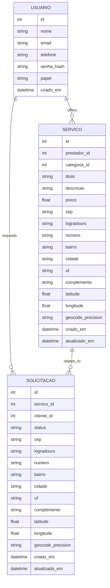

# Modelo de Dados – Desenrola Ai

> Modelo de dados da aplicacao Desenrola Ai.

---

## 1. Escopo e Objetivo
Este documento descreve **todas as entidades, atributos, relacionamentos, regras e dicionario de dados** do sistema. O modelo atende aos requisitos funcionais do projeto, incluindo cadastro de usuarios, servicos, solicitacoes e suporte a enderecos e coordenadas geograficas para exibicao em mapas e logistica de atendimento.

---

## 2. Visao Geral do Modelo
O modelo contempla tres entidades principais:
- **USUARIO**: pessoas que utilizam a plataforma (cliente ou prestador).
- **SERVICO**: oferta publicada por um prestador (com campo de categoria escolhida de lista predefinida).
- **SOLICITACAO**: pedido realizado por um cliente para um servico especifico.

Inclui campos de **endereco** e **coordenadas geograficas (latitude/longitude)** para: (a) preencher enderecos, (b) localizar pontos no mapa e (c) apoiar rotinas de logistica. Esses campos estao definidos de forma **completa** nas entidades **SERVICO** e **SOLICITACAO**.

---

## 3. Entidades e Atributos
- **USUARIO**(id, nome, email, telefone, senha_hash, papel: CLIENTE|PRESTADOR, criado_em)
- **SERVICO**(id, prestador_id, categoria_id, titulo, descricao, preco, cep, logradouro, numero, bairro, cidade, uf, complemento, latitude, longitude, geocode_precision, criado_em, atualizado_em)
- **SOLICITACAO**(id, servico_id, cliente_id, status, cep, logradouro, numero, bairro, cidade, uf, complemento, latitude, longitude, geocode_precision, criado_em, atualizado_em)

---

## 4. Diagrama ER (Mermaid)

---

## 5. Regras de Negocio e Constraints
- **Integridade Referencial**
  - `SERVICO.prestador_id` referencia `USUARIO.id` (papel = PRESTADOR).
  - `SOLICITACAO.cliente_id` referencia `USUARIO.id` (papel = CLIENTE).
  - `SERVICO.categoria` deve seguir lista predefinida (sem FK).

- **Consistencia de Status**
  - `SOLICITACAO.status` ∈ {PENDENTE, NEGOCIACAO, CONFIRMADO, RECUSADO}.

- **Validacoes de Endereco e Coordenadas**
  - `cep` com 8 digitos numericos (somente numeros).
  - `uf` com 2 letras.
  - `latitude` ∈ [-90, 90] e `longitude` ∈ [-180, 180].
  - `geocode_precision` ∈ {rooftop, interpolated, approximate}.

- **Auditoria**
  - `criado_em` e `atualizado_em` devem ser registrados em `SERVICO` e `SOLICITACAO`.

- **Semantica de Endereco**
  - `SERVICO` guarda o **local padrao** do prestador (quando aplicavel).
  - `SOLICITACAO` guarda o **local especifico** do atendimento (pode diferir do servico).

---

## 6. Dicionario de Dados Completo

### 6.1 USUARIO
| Campo      | Tipo     | Obrigatorio | Descricao                             |
|------------|----------|-------------|---------------------------------------|
| id         | int      | S           | Identificador unico                   |
| nome       | string   | S           | Nome completo                         |
| email      | string   | S           | Email unico                           |
| telefone   | string   | S           | Telefone                              |
| senha_hash | string   | S           | Hash da senha                         |
| papel      | string   | S           | CLIENTE ou PRESTADOR                  |
| criado_em  | datetime | S           | Data/hora de criacao                  |

### 6.3 SERVICO
| Campo             | Tipo     | Obrigatorio | Descricao                                         |
|-------------------|----------|-------------|---------------------------------------------------|
| id                | int      | S           | Identificador unico                               |
| prestador_id      | int FK   | S           | Referencia ao usuario prestador                   |
| categoria         | string   | S           | Categoria vinda de lista predefinida (ou \"Outros\") |
| titulo            | string   | S           | Titulo do servico                                 |
| descricao         | string   | S           | Descricao detalhada                               |
| preco             | float    | N           | Preco ou valor a combinar                         |
| cep               | string   | N           | CEP do local do prestador                         |
| logradouro        | string   | N           | Rua/Avenida                                       |
| numero            | string   | N           | Numero                                            |
| bairro            | string   | N           | Bairro                                            |
| cidade            | string   | N           | Cidade                                            |
| uf                | string   | N           | Unidade federativa (2 letras)                     |
| complemento       | string   | N           | Complemento                                       |
| latitude          | float    | N           | Coordenada latitude                               |
| longitude         | float    | N           | Coordenada longitude                              |
| geocode_precision | string   | N           | Precisao do geocoding                             |
| criado_em         | datetime | S           | Data/hora de criacao                              |
| atualizado_em     | datetime | S           | Data/hora da ultima atualizacao                   |

### 6.4 SOLICITACAO
| Campo             | Tipo     | Obrigatorio | Descricao                                         |
|-------------------|----------|-------------|---------------------------------------------------|
| id                | int      | S           | Identificador unico                               |
| servico_id        | int FK   | S           | Referencia ao servico                             |
| cliente_id        | int FK   | S           | Referencia ao usuario cliente                     |
| status            | string   | S           | PENDENTE, NEGOCIACAO, CONFIRMADO, RECUSADO        |
| cep               | string   | N           | CEP do local do atendimento                       |
| logradouro        | string   | N           | Rua/Avenida                                       |
| numero            | string   | N           | Numero                                            |
| bairro            | string   | N           | Bairro                                            |
| cidade            | string   | N           | Cidade                                            |
| uf                | string   | N           | Unidade federativa (2 letras)                     |
| complemento       | string   | N           | Complemento                                       |
| latitude          | float    | N           | Coordenada latitude                               |
| longitude         | float    | N           | Coordenada longitude                              |
| geocode_precision | string   | N           | Precisao do geocoding                             |
| criado_em         | datetime | S           | Data/hora de criacao                              |
| atualizado_em     | datetime | S           | Data/hora da ultima atualizacao                   |

---

## 7. Indices e Consideracoes de Desempenho
- Indices recomendados:
  - `USUARIO(email)` unico.
  - `SERVICO(prestador_id)`, `SERVICO(categoria)`, `SERVICO(cidade, uf)`.
  - `SOLICITACAO(servico_id)`, `SOLICITACAO(cliente_id)`, `SOLICITACAO(status)`.
- Se consultas por local forem frequentes, considerar indice composto em `(cidade, uf)` ou armazenamento geoespacial quando suportado.

---

## 8. Observacoes Finais
- O modelo e agnostico de SGBD. Em ambientes NoSQL (ex.: Parse/Back4App), os campos sao mapeados para classes/objetos correspondentes.
- Campos de auditoria devem ser preenchidos automaticamente pela camada de persistencia.
- Validacoes de formato (CEP, UF, ranges de latitude/longitude) devem ocorrer no backend antes de persistir.
