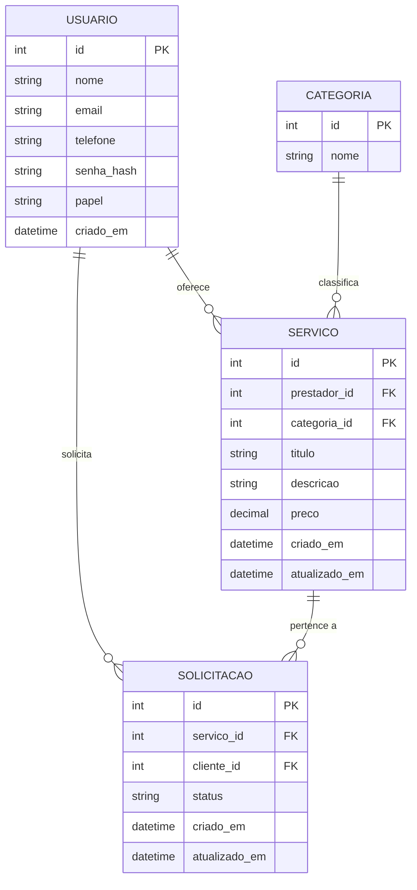

# Modelo de Dados – Desenrola Aí

## 1. Entidades principais
- **Usuario**(id, nome, email, telefone, senha_hash, papel: CLIENTE|PRESTADOR, criado_em)
- **Servico**(id, prestador_id, titulo, descricao, categoria, preco, criado_em, atualizado_em)
- **Solicitacao**(id, servico_id, cliente_id, status: PENDENTE|NEGOCIACAO|CONFIRMADO|RECUSADO, criado_em, atualizado_em)
- **Categoria**(id, nome)

## 2. Diagrama ER (Mermaid)

## 3. Dicionário de Dados (amostra)
- **USUARIO.email**: único, formato válido.
- **SERVICO.preco**: decimal(10,2), pode ser nulo quando “a combinar”.
- **SOLICITACAO.status**: enum('PENDENTE','NEGOCIACAO','CONFIRMADO','RECUSADO').

_Atualizado em 2025-08-31_
